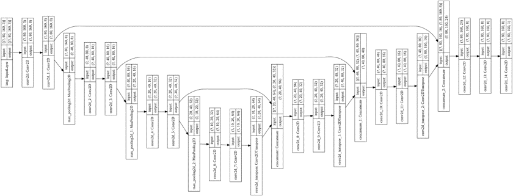
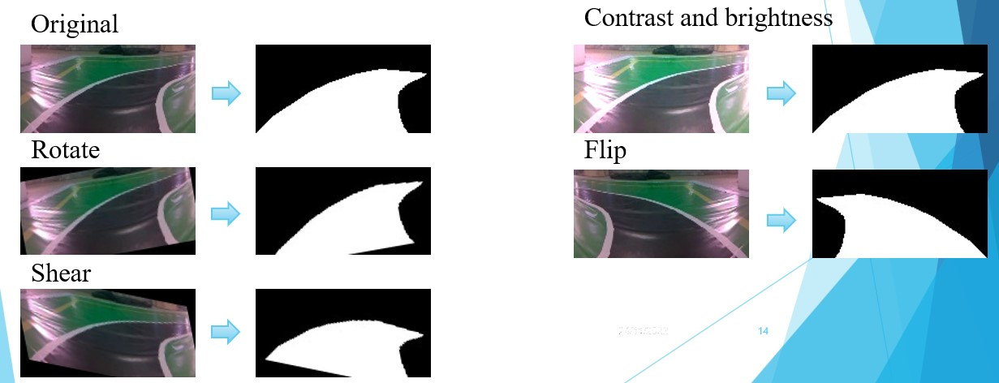
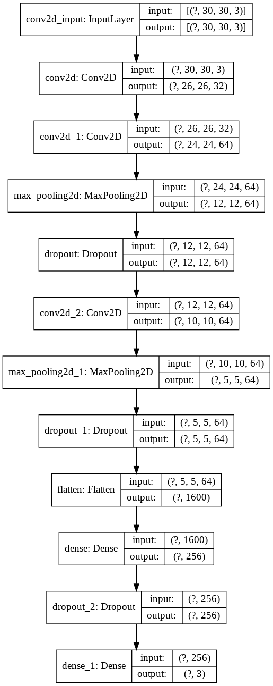

# Autonomous Car ITcar

## Run regconition tasks on Jetson Nano
### Convert Drivable Area Segmentation Model/Traffic Sign Classification Model to ONNX


### Convert YOLO to TensorRT
```python
    cd Recognition/yolo
    python3 yolo_to_onnx.py -m "model name"
    python3 onnx_to_tensorrt.py -m "model name"
```


### Run
```python
    cd Recognition
    run "python3 run.py"
```


## Drivable Area Segmentation
### Network Architecture



### Data Augmentation



### Training

```python
    run "training/DA segmentation.ipynb"
```

## Traffic Sign Object Detection

### YoloV4 tiny

[Darknet](https://github.com/AlexeyAB/darknet)

## Data

[Dowload link](https://drive.google.com/file/d/1S24XDlH59tueAPJYBmi0jPMY-7Zw6Odd/view?fbclid=IwAR20kjhgGz6XjPukK-mKMHYyziHs53W294v6n-zooweL_zvd5BLexKcxFkE)

## Traffic Sign Classification

### Network Architecture



## Data

[Dowload link](https://drive.google.com/drive/folders/1-11haKCpcDlAOxDNEM1b-Zg0JCIxWucO?fbclid=IwAR3WZ1En2ksc_T4W35QQEEGs3TTeh-IVhpReq4vRxprCDBMkNaBdf5vqCW8)


### Training

```python
    run "training/traffic sign classification.ipynb"
```


### Project status

- [x] Drivable Area Segmentation
- [x] Traffic Sign Object Detection
- [x] Traffic Sign Classification
- [x] Hardware Control
- [x] Control algorithm

***


