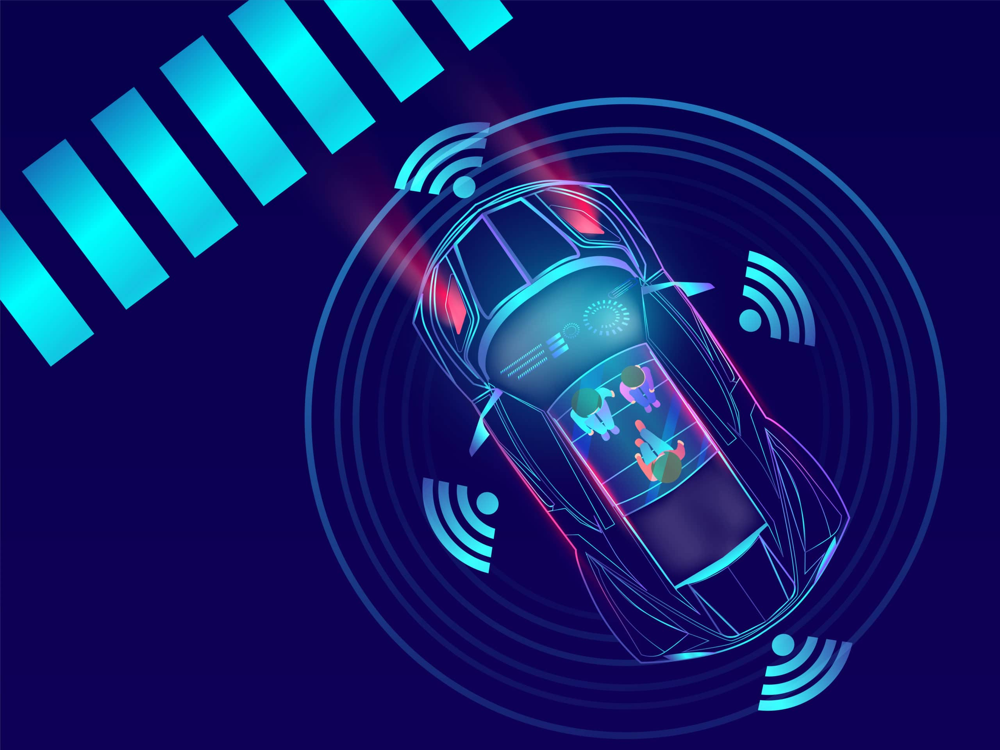

[][1]
[][2]
[][3]
[][5]


[][6]
[][8]


[1]: https://pytorch.org

[2]: https://www.facebook.com/syun128

[3]: https://wandb.ai/site

[4]: https://fastapi.tiangolo.com/

[5]: https://github.com/Syun1208

[6]: https://join.skype.com/invite/x3bJIhveDnae

[7]: https://git.sunshinetech.vn/dev/ai/icr/idc-transformation.git

[8]: https://www.linkedin.com/in/syun-cet


---
<!-- PROJECT LOGO -->
<br />
<div align="center">
    <h3>Hi, I'm Long, author of this repository 🚀.</h3>
  <a>
    
  </a>

<h1 align="center">AUTONOMOUS CAR - NEW EVOLUTION 2022</h1>
</div>

### Frameworks and Environments

* [][1]
* 
* 
## Getting Started

### Prerequisites

<a>
    
</a>

First of all, we need to install anaconda environment.

* conda
    ```sh
    conda create your_conda_environment
    conda info --envs
    conda activate your_conda_environment
    ```
2. Testing on local computer

* Put your image's option and run to see the result
  ```sh
  pip install -r path/to/requirements.txt
  python test_client.py
  ```
3. Docker

* Put your image's option and run to see the result
  ```sh
  sudo docker run -it --gpus all --network="host" -p 11000:11000 --add-host=host.docker.internal:host-gateway pholotino_it_car_2022_vong_1:latest
  python test_client.py
  ```
